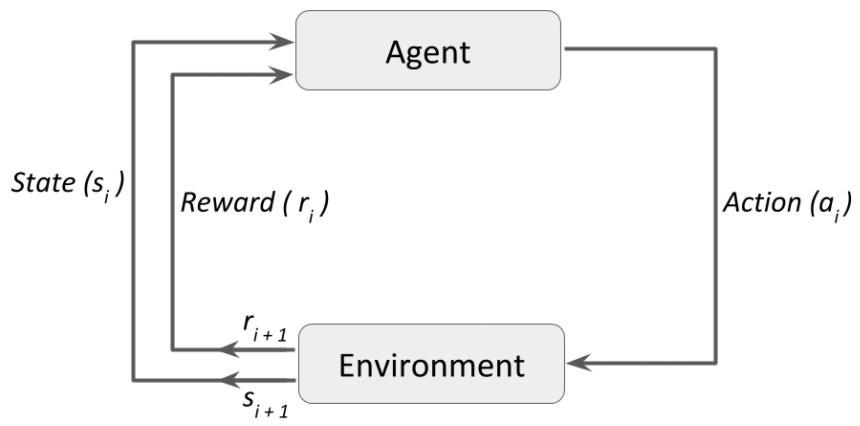

# Reinforcement Learning

Two basic components: Environment and agent.

Basic flow:

    Loop:
        Environment sends a State to an Agent

        Agent take an Action

        Environment sends a pair: [Next State, Reward] to Agent

        Agent assesses last action based on reward and takes next Action

    Do Loop until Environment sends a Terminal State

The agent seeks to perform the action in a way that the reward maximizes.

    

## Definitions

* Action (A): Moves an agent can take
* State (S): Current situation returned by the environment
* Reward (R): Immediate return send from the environment to evaluate last action
* Policy (&Pi;): Agent's strategy to determine next action based on current state
* Value (V): Expected long-term return with discount, as opposed to the short-term reward R.
    * V&pi;(s): Expected long-term return of the curretn state under policy &Pi;
* Q-value or action-value (Q): Value considering an extra-parameter: the current action *a*.
    * Q&pi;(s,a): Long-teem return of the current state *s*, taking action *a* under policy &pi;

## References

[1: Datacamp - Introduction to reinforcement learning](https://www.datacamp.com/community/tutorials/introduction-reinforcement-learning)

[2: Towards Data Science - Introduction to Various Reinforcement Learning Algorithms. Part I](https://towardsdatascience.com/introduction-to-various-reinforcement-learning-algorithms-i-q-learning-sarsa-dqn-ddpg-72a5e0cb6287)

[3: Wikipedia - Bellman's Equation](https://en.wikipedia.org/wiki/Bellman_equation)